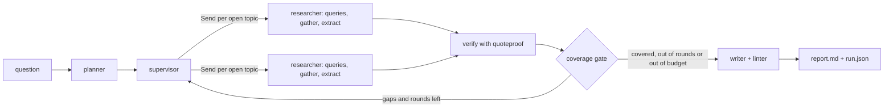

# 🔎 deep-research

> Research agent with a citation verifier. Every quote is checked against the page it cites before it reaches the report.

**In the committed live eval (3 questions), the verifier rejected 5 of 42 model-proposed claims (rejection rate 0.119) and 0 unverifiable citations shipped. On the offline benchmark it accepts 200 of 200 genuine quotes and rejects 812 of 812 mutated ones.** Sources: `evals/results/2026-10-04.json` and `bench/results/latest.json`. Three questions are a demo, not a statistic.

<!-- readme-header -->
[](https://github.com/sathwikbairaboina2/deep-research/actions/workflows/ci.yml)    

| Measured | Source |
|---|---|
| **0 bad citations shipped** | `evals/results/2026-10-04.json` |
| **812 / 812 fakes rejected** | `bench/results/latest.json` |

A local-first LangGraph research agent. A local model (Ollama) proposes claims, each with a quote copied from a page. A deterministic verifier, `quoteproof`, throws out every claim whose quote is not on the page it cites. Only verified claims reach the report.

## What it looks like

This is real output from `dr show --rejected` on the question "How does the Python GIL affect CPU-bound multithreaded programs?" (`examples/python-gil/`). The model proposed 12 claims, and the verifier rejected 4:

```text
claim_id | status   | reason           | claim
t1-r1-c1 | rejected | QUOTE_NOT_FOUND  | The Global Interpreter Lock (GIL) is a mutex in CPython t...
           quote: Global Interpreter Lock (GIL) is a mutex (mutual-exclusion lock) used in the ...
t1-r1-c2 | rejected | QUOTE_NOT_FOUND  | CPython uses reference counting for memory management, an...
           quote: In CPython, every Python object uses reference counting for memory management...
t1-r1-c4 | rejected | QUOTE_NOT_FOUND  | The GIL is released when Python performs blocking I/O ope...
           quote: The GIL is released when Python is doing blocking I/O... the underlying C cal...
t1-r1-c6 | rejected | QUOTE_NOT_FOUND  | The GIL persists in CPython because removing it would req...
           quote: The alternatives to the GIL is fine-grained locking on every object... more o...
```

The model put `...` inside its quotes, so they are not on the page. The report only uses the claims that passed. A line from `examples/python-gil/report.md`:

> In standard CPython, the Global Interpreter Lock (GIL) restricts execution so that only one thread can run Python bytecode at a time [^1].

Every footnote is a verified quote plus its URL. A line from `examples/sqlite-wal/report.md`:

> [^1]: "WAL provides more concurrency as readers do not block writers and a writer does not block readers. Reading and writing can proceed concurrently." - https://www.sqlite.org/wal.html

The other example, `examples/sqlite-wal/`, is an honest zero: the model proposed 18 claims and all 18 verified. `dr verify` re-checks a finished run from the stored pages (`examples/sqlite-wal/verify.txt`: `unverifiable: 0`).

## What it does not prove

The verifier checks that a quote is on the page. It does not check that the quote supports the claim, so a real quote can still be attached to the wrong claim ([ADR-0002](docs/adr/0002-exact-normalized-substring.md)). It also rejects some true quotes when the page text and the quote differ in more than whitespace, quotes and dashes. The benchmark measures that false-rejection rate on five pages; it is not a general guarantee.

## Quickstart

You need Docker, [uv](https://docs.astral.sh/uv/), and [Ollama](https://ollama.com) with the model pulled (`ollama pull qwen3.8:27b`).

```bash
docker compose up -d searxng          # search on http://127.0.0.1:5300
uv sync
uv run dr run "How does SQLite WAL mode affect reader and writer concurrency?" --topics 3 --rounds 1
uv run dr show <run_id> --rejected    # the claims the verifier threw out
uv run dr verify <run_id>             # re-check the run from the stored pages
uv run dr serve                       # http://127.0.0.1:5301, quote highlighted in the source page
docker compose down
```

On Windows hosts where Application Control blocks the `dr.exe` launcher, use `uv run python -m deep_research ...` instead of `dr ...` ([ADR-0008](docs/adr/0008-toolchain-and-isolation.md)). In Docker, `dr serve` needs `--host 0.0.0.0` to be reachable through the published port.

Other commands: `dr resume <run_id>` continues a crashed run from its checkpoint, `dr bench` reruns the offline benchmark, `dr eval --limit 3` runs the live eval.

## quoteproof

The verifier is its own zero-dependency package (standard library only, Python 3.10 or newer).

```python
from quoteproof import Citation, Claim, verify_claim

page = {"sha256:abc": "WAL provides more concurrency as readers do not block writers."}
claim = Claim("c1", "WAL helps readers", (Citation("sha256:abc", "concurrency as readers do not block writers"),))
print(verify_claim(claim, page).status)  # verified
```

Build and try the wheel (nothing is published):

```bash
uv build --package quoteproof
uv run --isolated --no-project --with dist/quoteproof-0.1.0-py3-none-any.whl python -c "import quoteproof; print(quoteproof.__version__)"
```

## Architecture



State lives in LangGraph with a SQLite checkpoint, so `dr resume` re-runs only the failed branch. Page texts are stored by SHA-256 in SQLite, and the verifier only ever sees those stored texts. Every I/O edge (LLM, search, fetch) is injected, so the whole graph runs in tests with sockets disabled.

## Guarantees and the tests that guard them

| Guarantee | Test |
|---|---|
| The writer sees only verified claims | `tests/test_writer.py::test_writer_input_only_verified` |
| The verifier is pure (same input, same verdict, no I/O) | `packages/quoteproof/tests/test_verify.py::test_verifier_is_pure` |
| Mutated quotes are rejected | `packages/quoteproof/tests/test_verify.py::test_mutated_quotes_rejected` |
| Every report marker is a verified claim | `packages/quoteproof/tests/test_lint.py::test_linter_rejects_orphan_markers`, `tests/test_graph.py::test_report_markers_all_verified` |
| Search and fetch caps are exact under threads | `tests/test_budget.py::test_budget_hard_caps`, `tests/test_graph.py::test_graph_respects_search_cap` |
| Fetch byte cap, timeout and content-type allowlist | `tests/test_fetch.py::test_fetch_limits` (real local HTTP server) |
| Parallel researchers never lose claims | `tests/test_graph.py::test_fanout_merge` |
| Resume does not refetch | `tests/test_resume.py::test_resume_after_crash` |
| Round and fan-out caps hold | `tests/test_graph.py::test_round_and_fanout_caps` |

## Limits

- No JavaScript rendering, no PDF page citations, no judge for "does this quote support the claim", no hosted model providers ([ADR-0004](docs/adr/0004-v0-1-scope.md)).
- The live eval is three questions with small caps. One question can hit its fetch cap before every topic is covered; the report says which caps were hit and which topics are under-covered.
- The token cap is a reservation, not an exact count ([ADR-0005](docs/adr/0005-budget-ledger.md)). An LLM call is not interrupted when the wall-clock cap passes; the cap is checked before each call.
- The writer can fall back to a plain bullet list when the model's draft fails the marker linter twice ([ADR-0007](docs/adr/0007-writer-fallback.md)). In the live eval, `evals/results/2026-10-04.json` records 1 fallback in 3 reports.
- Nothing is published to PyPI and nothing was pushed anywhere.

## Decisions

Ten ADRs with what each one gave up are in [docs/adr](docs/adr/README.md). The benchmark method and its caveats are in [bench/README.md](bench/README.md).

## Hardware note

The live numbers come from one Windows machine with Ollama serving `qwen3.8:27b` (digest in `evals/results/2026-10-04.json`). Ollama reported `size_vram` 0 whenever I checked during these runs, so inference was on the CPU, and the machine was shared with other jobs. Per-question wall times are in the eval file (983.391, 885.64 and 1058.844 seconds). They say nothing about speed on a free GPU.

## License

MIT
