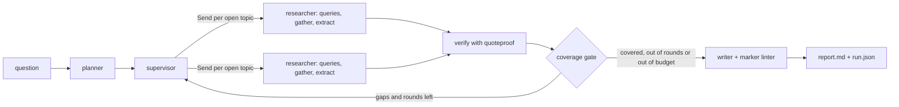

# deep-research developer guide

## 1. What it is

deep-research is a local-first research agent built on LangGraph. A local model (Ollama) reads web pages and proposes claims. Each claim carries a quote copied from a page. A small deterministic verifier, `quoteproof`, checks that each quote really is on the page it cites. Claims that fail are thrown out. Only verified claims reach the report.

**Headline (measured):**

- Live eval, 3 questions: the verifier rejected 5 of 42 model-proposed claims (rate 0.119). 0 unverifiable citations shipped. Source: `evals/results/2026-10-04.json`.
- Offline benchmark: it accepts 200 of 200 genuine quotes and rejects 812 of 812 mutated quotes. Source: `bench/results/latest.json`.

Three questions make a demo, not a statistic.

## 2. Quickstart (5 minutes)

You need Docker, [uv](https://docs.astral.sh/uv/) and [Ollama](https://ollama.com).

```bash
ollama pull qwen3.8:27b                 # the default model (override with DR_MODEL)
docker compose up -d searxng            # search on http://127.0.0.1:5300
uv sync
uv run dr run "How does SQLite WAL mode affect reader and writer concurrency?" --topics 3 --rounds 1
uv run dr show <run_id> --rejected      # the claims the verifier threw out
uv run dr verify <run_id>               # re-check the run from the stored pages
uv run dr serve                         # http://127.0.0.1:5301
docker compose down
```

On Windows, Application Control may block the `dr.exe` launcher. Then use `uv run python -m deep_research ...` instead of `uv run dr ...`. See [ADR-0008](adr/0008-toolchain-and-isolation.md).

No model or search engine yet? The offline benchmark still runs, and `examples/` holds two real runs:

```bash
uv run dr bench --check bench/results/latest.json
```

Runs land in `./runs/<run_id>/` (`report.md`, `run.json`, a SQLite checkpoint and page store). Set `DR_RUNS_DIR` to move them.

Settings come from environment variables: `OLLAMA_BASE_URL`, `SEARXNG_URL`, `DR_MODEL` and `DR_RUNS_DIR`.

## 3. Architecture



How it fits together:

- The **planner** splits the question into topics.
- The **supervisor** sends one researcher per open topic, in parallel, with LangGraph `Send`.
- A **researcher** writes search queries, searches SearXNG, fetches pages and asks the model for claims. The model cites short labels (`S1`, `S2`). Code maps them back to page IDs ([ADR-0006](adr/0006-source-labels.md)).
- Page texts are stored by SHA-256 in SQLite. The verifier only sees these stored texts.
- **quoteproof** normalizes both sides (NORM_V1: NFKC, plain quotes and dashes, collapsed whitespace, casefold) and needs an exact substring match. Every citation of a claim must pass.
- The **coverage gate** loops back while topics are thin and rounds and budget are left.
- The **writer** sees only verified claims. Its draft uses `[c:<claim_id>]` markers. A linter rejects unknown or rejected markers. After one failed retry, a deterministic bullet-list report is used instead ([ADR-0007](adr/0007-writer-fallback.md)).
- A **budget** object outside graph state caps searches, fetches, tokens and wall time. It is thread-safe and persisted, so resume does not double count ([ADR-0005](adr/0005-budget-ledger.md)).
- LangGraph checkpoints to SQLite. `dr resume` re-runs only the branch that failed.
- Every I/O edge (LLM, search, fetch) is injected through `Deps`. Tests run the whole graph with sockets disabled.

## 4. Project layout

| Path | What it holds |
|---|---|
| `packages/quoteproof/` | The verifier package. Standard library only. `normalize.py`, `verify.py`, `lint.py` |
| `src/deep_research/graph.py`, `nodes.py`, `researcher.py` | The LangGraph graph, node functions and researcher subgraph |
| `src/deep_research/writer.py` | Verified-only writer, linter retry, fallback report, footnotes |
| `src/deep_research/runner.py` | Starts, resumes and re-verifies runs; writes `run.json` and `report.md` |
| `src/deep_research/budget.py` | Thread-safe caps and the persisted budget ledger |
| `src/deep_research/search.py`, `fetch.py`, `urls.py` | SearXNG client, capped HTTP fetch, URL cleanup |
| `src/deep_research/llm.py`, `prompts.py`, `models.py` | Ollama structured-output client, prompts, Pydantic schemas |
| `src/deep_research/store.py` | SQLite page store keyed by SHA-256 |
| `src/deep_research/cli.py` | `dr run`, `resume`, `show`, `verify`, `eval`, `bench`, `serve` |
| `src/deep_research/bench.py` | Offline verifier benchmark |
| `src/deep_research/evals.py` | Live eval harness and scoring |
| `src/deep_research/serve.py` | Read-only web viewer with quote highlighting (stdlib HTTP) |
| `tests/` | Unit and fake-LLM graph tests. `fakes.py` holds the shared fakes. `test_live.py` is opt-in |
| `tests/fixtures/` | Five public-domain SQLite doc pages and one recorded SearXNG response |
| `bench/` | Benchmark method (`README.md`) and the committed result `results/latest.json` |
| `evals/` | The 12-question suite and the live results |
| `examples/` | Two real runs: `sqlite-wal` and `python-gil` |
| `searxng/` | SearXNG settings for the compose service |
| `docs/adr/` | Ten decision records |
| `.superpowers/sdd/` | Build ledger with every ruling made during the build |

## 5. Run, test and benchmark

```bash
uv sync --frozen
uv run ruff check . && uv run ruff format --check .          # lint
uv run pytest                                               # 136 passed, 1 skipped (live)
uv run dr bench --check bench/results/latest.json           # fails if the result drifts
uv build --package quoteproof && uv build --package deep-research
docker compose build app
docker compose run --rm --entrypoint "" app pytest          # same suite inside the image
docker compose down
```

Live checks need Ollama and SearXNG running:

```bash
DR_LIVE=1 uv run pytest -m live
uv run dr eval --limit 3 --topics 3 --rounds 1 --max-searches 6 --max-fetches 9
```

`dr eval` writes `evals/results/<date>.json` and `.md`. It exits non-zero if any unverifiable citation shipped.

CI (`.github/workflows/ci.yml`) runs lint, tests, `bench --check`, both wheel builds and the Docker build. It was validated locally only. Nothing was pushed.

Ports: SearXNG on 5300 and the viewer on 5301. Compose names start with `deep-research-`.

## 6. Key decisions and what they gave up

| Decision | What it gave up |
|---|---|
| [ADR-0001](adr/0001-quoteproof-zero-dependency-package.md): the verifier is its own zero-dependency package | A second package to version and build |
| [ADR-0002](adr/0002-exact-normalized-substring.md): exact substring match after NORM_V1, and all citations must pass | Some true quotes are rejected when the page differs by more than whitespace, quotes or dashes. It does not check that a quote supports its claim |
| [ADR-0003](adr/0003-ollama-native-structured-output.md): Ollama `/api/chat` with a JSON-schema `format` | No hosted providers in v0.1 |
| [ADR-0004](adr/0004-v0-1-scope.md): fan-out and resume are in; JS rendering, PDF page cites and an LLM judge are out | Pages that need JavaScript return little text |
| [ADR-0005](adr/0005-budget-ledger.md): exact search and fetch caps, reserved tokens | The token cap is not exact. Wall time is checked before each call, not during one |
| [ADR-0006](adr/0006-source-labels.md): the model cites `S1..Sn` labels | Prompt space for a label table |
| [ADR-0007](adr/0007-writer-fallback.md): one lint retry, then a deterministic fallback | The fallback report is a plain bullet list |
| [ADR-0008](adr/0008-toolchain-and-isolation.md): uv on the host, Docker for SearXNG and parity | Two ways to run, documented separately |
| [ADR-0009](adr/0009-testing-without-network.md): tests never touch the network | Live behavior is covered only by the opt-in live test and the eval |
| [ADR-0010](adr/0010-headline-measurement.md): headline numbers come only from committed bench and eval JSON | Small numbers stay small; nothing is extrapolated |

## 7. Known limits and what is left

- The verifier checks that a quote is on the page. It does not check that the quote supports the claim.
- No JavaScript rendering, no PDF page citations, no LLM judge and no hosted model providers.
- The live eval is 3 questions with small caps. It ran on one shared Windows machine with Ollama on the CPU (`size_vram` 0). Wall times (about 890 to 1060 seconds per question) say nothing about GPU speed.
- One example run (`python-gil`) hit its fetch cap. The report says which caps were hit and which topics are thin.
- The writer fell back to the bullet-list report in 1 of 3 eval questions.
- A resumed run gets a fresh wall-clock budget. `run.json` records each segment.
- What is left: run the full 12-question eval on a GPU, add a "does the quote support the claim" check, and publish `quoteproof` to PyPI. Nothing is published or pushed yet.
