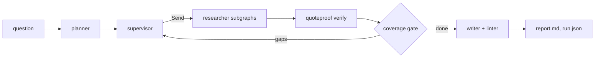

# deep-research developer guide (draft)

The Opus lead rewrites this file at the end. This is the builder's draft in the required order.

## 1. What it is

A local-first LangGraph research agent. A local model proposes claims with quotes. The `quoteproof` verifier rejects every claim whose quote is not on the page it cites. Only verified claims reach the report.

Measured headline (from `evals/results/2026-10-04.json` and `bench/results/latest.json`): the verifier rejected 5 of 42 proposed claims in 3 live questions (rate 0.119) with 0 unverifiable citations shipped. Offline it accepts 200 of 200 genuine quotes and rejects 812 of 812 mutated ones.

## 2. Quickstart (5 minutes)

```bash
docker compose up -d searxng
uv sync
uv run python -m deep_research run "How does SQLite WAL mode affect reader and writer concurrency?" --topics 3 --rounds 1
uv run python -m deep_research show <run_id> --rejected
uv run python -m deep_research verify <run_id>
uv run python -m deep_research serve
docker compose down
```

Needs Ollama on the host with `qwen3.8:27b`. On Linux and in Docker the same commands are `dr ...`.

## 3. Architecture



## 4. Project layout

| Path | What |
|---|---|
| `packages/quoteproof/` | Zero-dependency verifier: normalize, verify, lint |
| `src/deep_research/` | Agent: search, fetch, store, llm, budget, nodes, researcher, graph, writer, runner, cli, bench, evals, serve |
| `tests/` | Unit and fake-LLM graph tests; sockets disabled; `fakes.py` holds the shared fakes |
| `tests/fixtures/` | Five public-domain SQLite doc pages and one recorded SearXNG response |
| `bench/results/latest.json` | Offline benchmark result (checked in CI) |
| `evals/` | 12-question suite and live results |
| `examples/` | Real runs: `sqlite-wal` and `python-gil` |
| `docs/adr/` | Ten decision records |

## 5. Run, test and benchmark

```bash
uv run pytest                                              # sockets disabled; the live test skips
uv run ruff check . && uv run ruff format --check .
uv run python -m deep_research bench --check bench/results/latest.json
DR_LIVE=1 uv run pytest -m live                            # needs Ollama and SearXNG
uv run python -m deep_research eval --limit 3 --topics 3 --rounds 1 --max-searches 6 --max-fetches 9
docker compose build app && docker compose run --rm --entrypoint "" app pytest
```

## 6. Key decisions

See `docs/adr/README.md`. Each record lists what it gave up. The big ones: exact substring match after NORM_V1 (ADR-0002), fan-out and resume in v0.1 (ADR-0004), reserved token budget (ADR-0005), writer fallback (ADR-0007).

## 7. Known limits and what is left

- Checks that a quote is on the page, not that it supports the claim.
- No JavaScript rendering, PDF page cites, LLM judge or hosted providers.
- Live eval is three questions on a CPU-bound shared machine.
- Wall-clock cap is checked before each call, not during one.
- CI was validated locally only; nothing was pushed.
